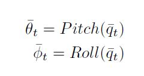
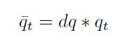
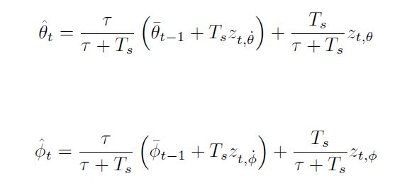
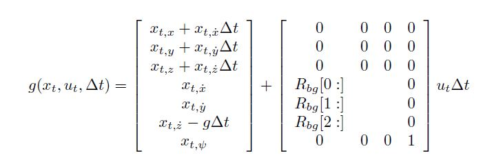
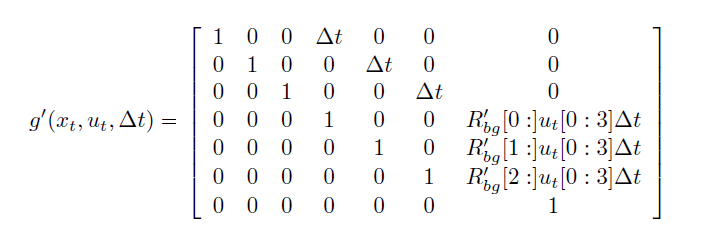
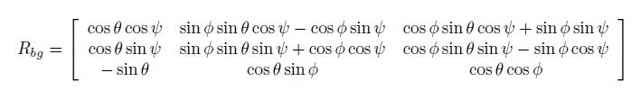

# Estimation Project #

## The Tasks ##

### Task 1: Sensor Noise ###

For this step, I run the simulation, and then loaded the recorded data to matlab to get the standard deviation. Following are the valeus I got:

```
MeasuredStdDev_GPSPosXY = 0.7217
MeasuredStdDev_AccelXY = 0.4900
```

### Task 2: Attitude Estimation ###

In order to improve the complementary filter, following the 7.1.2 section in Estimation for Quadrotors, code was converted to the nonlinear complementary filter using quarterions in the following equations:



where 



and replace estimates in filter as follows:




### Step 3: Prediction Step ###

First, we implement the prediction state in `PredictState()` defined by transition function  



then we implement the prediction covariance in `PredictCovariance()` defined by Jacobian matrix:



where rotation matrix is defined as:



### Task 4: Magnetometer Update ###

Code was modified according to 7.3.2 of [Estimation for Quadrotors](https://www.overleaf.com/read/vymfngphcccj) to implement the magnetometer update step. Changes are implemented as follows in `UpdateFromMag()`:

```
hPrime(0, 6) = 1;
zFromX(0) = ekfState(6);
```


### Task 5: Closed Loop + GPS Update ###

Similar to Task 4, code was modified accoring to 7.3.1 of [Estimation for Quadrotors](https://www.overleaf.com/read/vymfngphcccj) to implement the GPS update. Changes are implemented in `UpdateFromGPS()`.

### Task 6: Adding Your Controller ###

`QuadController.cpp` was replaced with the controller from the last project.

Gains were retuned to:

kpPosXY = 30 => 4
KiPosZ = 30 => 21 

kpVelXY = 12 => 8
kpVelZ = 12 => 8